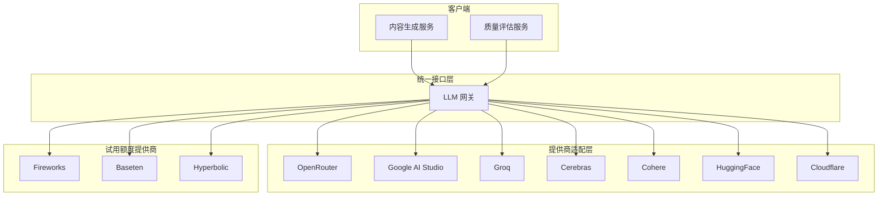

# LiteLLM 多提供商集成技术设计

Feature Name: litellm-integration
Updated: 2026-02-14

## Description

本文档描述了如何将 free-llm-api-resources 项目中的免费和试用额度 LLM API 服务集成到现有 AI 内容创作系统中。通过统一封装多个提供商，提供稳定、可靠的 AI 推理服务。

## Architecture

### 整体架构



### 项目结构

```
server/
├── services/
│   ├── llm/
│   │   ├── index.js              # 统一出口
│   │   ├── providers/
│   │   │   ├── openrouter.js     # OpenRouter 适配器
│   │   │   ├── googleai.js        # Google AI Studio 适配器
│   │   │   ├── groq.js          # Groq 适配器
│   │   │   ├── cerebras.js      # Cerebras 适配器
│   │   │   ├── cohere.js        # Cohere 适配器
│   │   │   ├── huggingface.js    # HuggingFace 适配器
│   │   │   ├── cloudflare.js    # Cloudflare 适配器
│   │   │   └── trial/           # 试用额度提供商
│   │   │       ├── fireworks.js
│   │   │       ├── baseten.js
│   │   │       └── hyperbolic.js
│   │   ├── registry.js          # 提供商注册表
│   │   ├── router.js            # 路由策略
│   │   ├── health.js           # 健康检查
│   │   └── metrics.js          # 成本追踪
│   └── ...
└── ...
```

## Components

### 1. 提供商适配器基类

```javascript
// server/services/llm/providers/base.js
class BaseProvider {
  constructor(config) {
    this.name = config.name;
    this.apiKey = config.apiKey;
    this.endpoint = config.endpoint;
    this.enabled = !!config.apiKey;
    this.rateLimit = config.rateLimit || { rpm: 60, tpm: 60000 };
    this.models = config.models || [];
  }

  async generate(messages, options) {
    throw new Error('Not implemented');
  }

  async checkHealth() {
    throw new Error('Not implemented');
  }

  isAvailable() {
    return this.enabled && this.currentRate < this.rateLimit.rpm;
  }
}
```

### 2. OpenRouter 适配器

```javascript
// server/services/llm/providers/openrouter.js
const axios = require('axios');

class OpenRouterProvider extends BaseProvider {
  constructor(config) {
    super({
      name: 'openrouter',
      apiKey: process.env.OPENROUTER_API_KEY,
      endpoint: 'https://openrouter.ai/api/v1/chat/completions',
      rateLimit: { rpm: 20, tpm: 100000 },
      models: [
        { id: 'google/gemma-3-12b-it:free', name: 'Gemma 3 12B', type: 'free' },
        { id: 'meta-llama/llama-3.1-405b-instruct:free', name: 'Llama 3.1 405B', type: 'free' },
        { id: 'qwen/qwen3-4b:free', name: 'Qwen3 4B', type: 'free' },
      ]
    });
  }

  async generate(messages, options = {}) {
    const response = await axios.post(
      this.endpoint,
      {
        model: options.model || 'google/gemma-3-12b-it:free',
        messages,
        max_tokens: options.maxTokens || 2000,
        temperature: options.temperature || 0.7,
      },
      {
        headers: {
          'Authorization': `Bearer ${this.apiKey}`,
          'HTTP-Referer': process.env.APP_URL || 'http://localhost',
          'X-Title': 'AI Content Generator',
        }
      }
    );

    return {
      content: response.data.choices[0].message.content,
      model: response.data.model,
      usage: response.data.usage,
    };
  }
}
```

### 3. Groq 适配器

```javascript
// server/services/llm/providers/groq.js
class GroqProvider extends BaseProvider {
  constructor(config) {
    super({
      name: 'groq',
      apiKey: process.env.GROQ_API_KEY,
      endpoint: 'https://api.groq.com/openai/v1/chat/completions',
      rateLimit: { rpm: 30, tpm: 15000 },
      models: [
        { id: 'llama-3.1-8b-instant', name: 'Llama 3.1 8B', type: 'free' },
        { id: 'llama-3.3-70b-versatile', name: 'Llama 3.3 70B', type: 'free' },
        { id: 'mixtral-8x7b-32768', name: 'Mixtral 8x7B', type: 'free' },
      ]
    });
  }
}
```

### 4. LLM 网关

```javascript
// server/services/llm/index.js
const { getProvider, getAllProviders, getProviderByModel } = require('./registry');
const { selectProvider } = require('./router');

class LLMGateway {
  constructor() {
    this.providers = new Map();
    this.fallbackChains = [
      ['openrouter', 'groq', 'cerebras', 'cohere'],
      ['google-ai', 'cloudflare'],
    ];
    this.init();
  }

  init() {
    const providers = getAllProviders();
    providers.forEach(provider => {
      if (provider.enabled) {
        this.providers.set(provider.name, provider);
      }
    });
  }

  async generate(messages, options = {}) {
    const { model, provider: preferredProvider, ...opts } = options;

    let provider;
    if (preferredProvider && this.providers.has(preferredProvider)) {
      provider = this.providers.get(preferredProvider);
    } else if (model) {
      provider = getProviderByModel(model);
    } else {
      provider = selectProvider(this.providers, this.fallbackChains);
    }

    if (!provider || !provider.isAvailable()) {
      for (const chain of this.fallbackChains) {
        for (const name of chain) {
          const p = this.providers.get(name);
          if (p && p.isAvailable()) {
            provider = p;
            break;
          }
        }
        if (provider) break;
      }
    }

    if (!provider) {
      throw new Error('No available provider');
    }

    try {
      const result = await provider.generate(messages, { ...opts, model });
      return {
        ...result,
        provider: provider.name,
      };
    } catch (error) {
      console.error(`Provider ${provider.name} failed:`, error);
      return this.generate(messages, { ...options, provider: null });
    }
  }

  async healthCheck() {
    const results = {};
    for (const [name, provider] of this.providers) {
      try {
        const healthy = await provider.checkHealth();
        results[name] = healthy ? 'healthy' : 'unhealthy';
      } catch {
        results[name] = 'unhealthy';
      }
    }
    return results;
  }
}

module.exports = new LLMGateway();
```

## Data Models

### 提供商配置

```javascript
// server/services/llm/providers/registry.js
const providers = {
  openrouter: {
    class: require('./openrouter'),
    envKey: 'OPENROUTER_API_KEY',
    type: 'free',
    priority: 1,
  },
  groq: {
    class: require('./groq'),
    envKey: 'GROQ_API_KEY',
    type: 'free',
    priority: 2,
  },
  cerebras: {
    class: require('./cerebras'),
    envKey: 'CEREBRAS_API_KEY',
    type: 'free',
    priority: 3,
  },
  googleai: {
    class: require('./googleai'),
    envKey: 'GOOGLE_AI_API_KEY',
    type: 'free',
    priority: 4,
  },
  cohere: {
    class: require('./cohere'),
    envKey: 'COHERE_API_KEY',
    type: 'free',
    priority: 5,
  },
  cloudflare: {
    class: require('./cloudflare'),
    envKey: 'CLOUDFLARE_API_KEY',
    type: 'free',
    priority: 6,
  },
  fireworks: {
    class: require('./trial/fireworks'),
    envKey: 'FIREWORKS_API_KEY',
    type: 'trial',
    trialCredits: 1,
    priority: 10,
  },
  hyperbolic: {
    class: require('./trial/hyperbolic'),
    envKey: 'HYPERBOLIC_API_KEY',
    type: 'trial',
    trialCredits: 1,
    priority: 11,
  },
};

module.exports = providers;
```

### 环境变量

```bash
# 免费提供商
OPENROUTER_API_KEY=sk-...
GROQ_API_KEY=gsk_...
CEREBRAS_API_KEY=...
GOOGLE_AI_API_KEY=...
COHERE_API_KEY=...
CLOUDFLARE_API_KEY=...

# 试用额度提供商
FIREWORKS_API_KEY=...
HYPERBOLIC_API_KEY=...
BASETEN_API_KEY=...
NEBIUS_API_KEY=...

# 通用配置
APP_URL=http://localhost:3000
DEFAULT_PROVIDER=openrouter
FALLBACK_STRATEGY=priority
```

## Correctness Properties

### 可用性保证

1. 至少 3 个免费提供商可用时，系统 SHALL 保证可用性 >= 99%
2. IF 主提供商不可用，THEN 切换时间 SHALL < 5 秒

### 速率限制遵守

1. IF 达到速率限制，THEN SHALL 立即切换到备用提供商
2. IF 所有提供商都达到限制，THEN SHALL 返回限流错误

### 成本控制

1. IF 使用试用额度提供商，THEN SHALL 记录每次调用成本
2. IF 剩余额度 < 10%，THEN SHALL 发送告警

## Error Handling

| Error Type | Handling Strategy |
|------------|------------------|
| API Key Missing | 标记提供商为不可用，跳过 |
| Rate Limited | 自动切换提供商 |
| Network Error | 重试 3 次后切换 |
| Invalid Response | 记录日志，返回错误 |
| All Providers Down | 返回 503 Service Unavailable |

## Test Strategy

### 单元测试

- 每个提供商适配器的 generate 方法
- 路由选择逻辑
- 速率限制检查
- 错误处理流程

### 集成测试

- 多提供商切换
- 负载均衡
- 健康检查

### 性能测试

- 并发请求测试
- 延迟测试
- 成本追踪准确性

## References

[^1]: (free-llm-api-resources) - Free LLM API Resources https://github.com/cheahjs/free-llm-api-resources
[^2]: (OpenRouter Docs) - OpenRouter API Documentation https://openrouter.ai/docs
[^3]: (Groq Docs) - Groq API Documentation https://console.groq.com/docs
