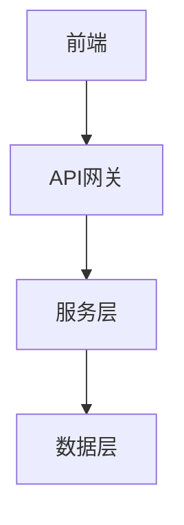

# 开发规范标准

本文档定义了项目开发过程中需求、设计和任务文档的编写规范。

## 文档结构

每个功能特性应包含以下三个核心文档：

```
docs/specs/{feature-name}/
├── requirements.md   # 需求文档
├── design.md         # 设计文档
└── tasklist.md       # 任务清单
```

---

## 一、需求文档规范 (requirements.md)

### 1.1 文档结构

```markdown
# 需求文档

## 引言
[功能背景和目标描述]

## 词汇表
| 术语 | 定义 |
|------|------|
| xxx | xxx 的说明 |

## 需求

### 需求N: {需求标题}

**用户故事:** AS {角色}, I WANT {目标}, SO THAT {价值}

#### 验收标准

1. WHEN {条件} THEN SHALL {预期行为}
2. IF {异常条件} THEN SHALL {异常处理}
3. WHILE {持续条件} THEN SHALL {持续行为}

## 非功能需求
- **性能**: ...
- **兼容性**: ...
- **安全性**: ...

## 依赖关系
- **前置依赖**: ...
- **后置影响**: ...
```

### 1.2 验收标准格式

使用 **WHEN-THEN-SHALL** 格式编写验收标准：

| 关键字 | 用途 | 示例 |
|--------|------|------|
| **WHEN** | 触发条件 | WHEN 用户点击提交按钮 |
| **THEN SHALL** | 预期行为 | THEN SHALL 系统验证表单数据 |
| **IF** | 异常条件 | IF 数据验证失败 |
| **WHILE** | 持续状态 | WHILE 数据加载中 |

### 1.3 用户故事格式

```
AS {角色}, I WANT {功能}, SO THAT {价值}
```

示例：
```
AS 内容运营者, I WANT 从热点视频提取文字内容, SO THAT 进行二次创作
```

---

## 二、设计文档规范 (design.md)

### 2.1 文档结构

```markdown
# 设计文档

## 概述
[功能概述和设计目标]

## 需求确认
| 维度 | 决策 |
|------|------|
| 技术选型 | xxx |
| 架构模式 | xxx |

## 整体架构

\`\`\`
[ASCII 架构图]
\`\`\`

## 模块划分

### 模块一：{模块名称}

**文件**: `path/to/file.js`

**职责**:
- 职责1
- 职责2

**核心接口**:
\`\`\`javascript
// 接口定义
\`\`\`

## 数据模型

\`\`\`javascript
// 数据结构定义
\`\`\`

## 接口设计

### API 端点

\`\`\`
POST /api/xxx
Request: { ... }
Response: { ... }
\`\`\`

## 错误处理

| 错误场景 | 处理策略 |
|----------|----------|
| xxx | xxx |

## 配置管理

\`\`\`yaml
# 配置示例
\`\`\`

## 实施计划

### 第一阶段：{阶段名称}
1. 任务1
2. 任务2
```

### 2.2 架构图规范

使用 ASCII 艺术或 Mermaid 语法绘制架构图：

**ASCII 格式示例**：
```
┌─────────────────────────────────────────────────┐
│                    前端层                        │
│  ┌─────────────┐  ┌─────────────┐              │
│  │  组件A      │  │  组件B      │              │
│  └─────────────┘  └─────────────┘              │
└────────────────────┬────────────────────────────┘
                     │ HTTP/WebSocket
                     ▼
┌─────────────────────────────────────────────────┐
│                    后端层                        │
└─────────────────────────────────────────────────┘
```

**Mermaid 格式示例**：


### 2.3 模块设计规范

每个模块应包含：

| 要素 | 说明 |
|------|------|
| **文件路径** | 源代码位置 |
| **职责** | 单一职责描述 |
| **依赖** | 依赖的其他模块 |
| **接口** | 对外暴露的接口 |
| **测试** | 测试策略 |

---

## 三、任务清单规范 (tasklist.md)

### 3.1 文档结构

```markdown
# 任务清单

## 状态概览

| 状态 | 数量 |
|------|------|
| ✅ 完成 | 5 |
| 🔄 进行中 | 2 |
| ⏳ 待开始 | 3 |

## 任务列表

### 第一阶段：{阶段名称}

- [ ] **任务1**: 任务描述
  - 验收标准: xxx
  - 预计工时: xh
- [x] **任务2**: 任务描述
  - 完成时间: YYYY-MM-DD

### 第二阶段：{阶段名称}

- [ ] **任务3**: 任务描述
```

### 3.2 任务状态标记

| 标记 | 状态 | 说明 |
|------|------|------|
| `- [ ]` | 待开始 | 任务未开始 |
| `- [x]` | 已完成 | 任务已完成 |
| `🔄` | 进行中 | 任务正在执行 |
| `⚠️` | 阻塞 | 任务被阻塞 |
| `❌` | 取消 | 任务已取消 |

### 3.3 任务描述规范

每个任务应包含：

1. **任务标题**：简洁明了的动作描述
2. **详细描述**：具体要做什么
3. **验收标准**：如何判断任务完成
4. **依赖关系**：依赖哪些任务
5. **预计工时**：时间估算（可选）

---

## 四、通用功能模板

以下功能模板可作为全局规则复用：

### 4.1 深色模式切换

适用于任何 React 项目，包含：
- 主题切换按钮
- localStorage 持久化
- 平滑过渡动画
- ARIA 可访问性

### 4.2 自动化开发服务器

适用于任何前后端分离项目，包含：
- 前端启动事件检测
- 后端服务自动启动
- 联动控制（同时启动/停止）
- 日志输出管理
- 安全关闭机制

### 4.3 API 服务层

适用于任何需要 API 调用的项目，包含：
- 统一请求封装
- 错误处理机制
- 重试策略
- 缓存管理

---

## 五、文档命名规范

### 5.1 目录命名

- 使用小写字母和连字符：`video-transcription`
- 避免使用缩写：`user-authentication` 而非 `user-auth`
- 使用功能描述而非技术描述：`dark-mode-toggle` 而非 `theme-context`

### 5.2 文件命名

| 文件类型 | 命名 | 说明 |
|----------|------|------|
| 需求文档 | `requirements.md` | 固定名称 |
| 设计文档 | `design.md` | 固定名称 |
| 任务清单 | `tasklist.md` | 固定名称 |
| 分析文档 | `{topic}-analysis.md` | 主题+analysis |
| 计划文档 | `{topic}-plan.md` | 主题+plan |

---

## 六、文档维护

### 6.1 版本控制

- 所有文档纳入 Git 版本控制
- 重大变更需更新文档版本号
- 使用 Git 提交信息关联文档变更

### 6.2 文档评审

- 需求文档：产品/业务评审
- 设计文档：技术评审
- 任务清单：团队评审

### 6.3 文档更新

- 需求变更：更新 requirements.md
- 设计调整：更新 design.md
- 任务进度：更新 tasklist.md
