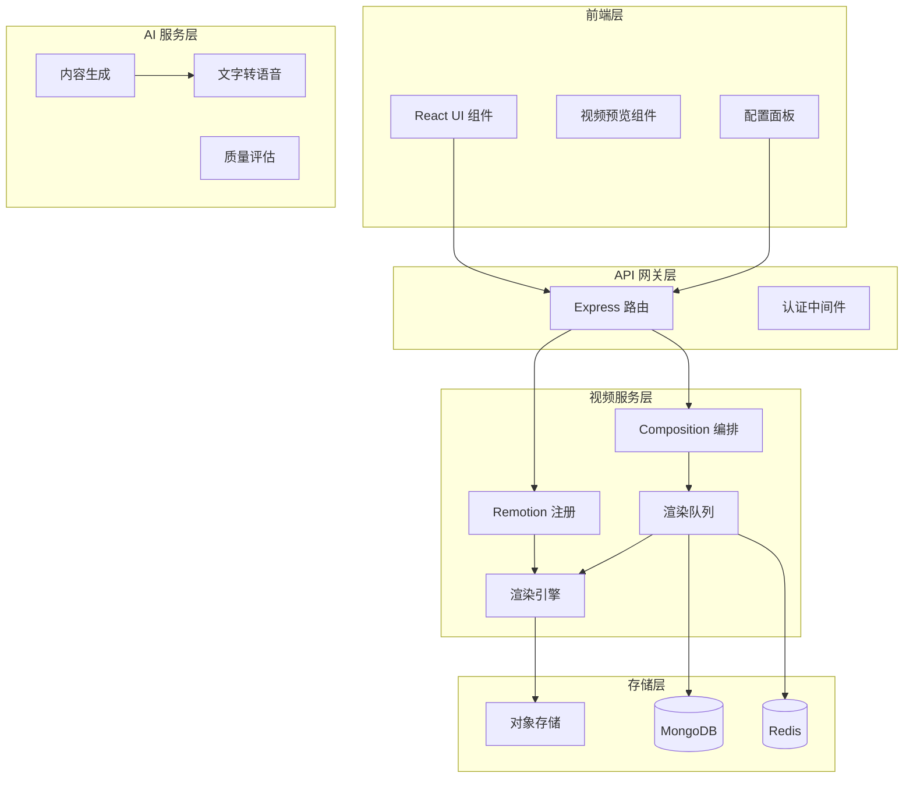

# Remotion 视频生成功能技术设计

Feature Name: remotion-video-generation
Updated: 2026-02-14

## Description

本设计文档描述了如何将 Remotion 框架集成到现有 AI 内容创作系统中，以实现程序化的视频生成能力。通过利用 React 生态系统，开发者可以使用声明式组件方式创建专业质量的视频，并支持批量生成和自动化工作流。

## Architecture

### 整体架构



### 项目结构

```
remotion-video/
├── src/
│   ├── compositions/           # 视频合成组件
│   │   ├── Root.tsx            # 根组件，注册所有 Composition
│   │   ├── HelloWorld.tsx      # 示例合成
│   │   ├── ArticleVideo.tsx   # 文章转视频模板
│   │   ├── MicroVideo.tsx     # 微头条视频模板
│   │   └── components/         # 可复用视频组件
│   │       ├── TitleCard.tsx   # 标题卡片
│   │       ├── TextOverlay.tsx # 文字叠加
│   │       ├── ImageSlide.tsx # 图片轮播
│   │       ├── BGM.tsx        # 背景音乐
│   │       └── Transition.tsx # 转场效果
│   ├── hooks/                  # 自定义 Hooks
│   │   ├── useVideoFrame.ts   # 帧级别控制
│   │   ├── useAudioSync.ts    # 音画同步
│   │   └── useTemplateData.ts # 模板数据绑定
│   ├── templates/              # 视频模板配置
│   │   ├── templates.json     # 模板元数据
│   │   └── configs/           # 模板配置
│   ├── server/                 # 服务端渲染
│   │   ├── renderer.ts        # 渲染服务
│   │   ├── queue.ts           # 渲染队列
│   │   └── tts.ts             # TTS 服务
│   ├── index.ts               # 入口点
│   └── remotion.config.ts     # 项目配置
├── public/                    # 静态资源
│   ├── fonts/                 # 字体文件
│   ├── images/                # 图片资源
│   └── audio/                 # 音频资源
└── package.json
```

## Components and Interfaces

### 1. Composition 注册组件

```typescript
// src/compositions/Root.tsx
import { Composition, registerRoot } from 'remotion';
import { ArticleVideo } from './ArticleVideo';
import { MicroVideo } from './MicroVideo';

export const registerVideo = () => {
  registerRoot(({ videos }) => (
    <>
      <Composition
        id="article-video"
        component={ArticleVideo}
        durationInFrames={900}  // 30fps * 30s
        fps={30}
        width={1920}
        height={1080}
        defaultProps={{
          title: '',
          content: '',
          images: [],
          backgroundMusic: null,
        }}
      />
      <Composition
        id="micro-video"
        component={MicroVideo}
        durationInFrames={450}  // 15s
        fps={30}
        width={1080}
        height={1920}  // 竖版视频
        defaultProps={{
          text: '',
          image: null,
        }}
      />
    </>
  ));
};
```

### 2. 视频组件示例

```typescript
// src/compositions/ArticleVideo.tsx
import { AbsoluteFill, useCurrentFrame, interpolate, spring } from 'remotion';
import { TitleCard } from './components/TitleCard';
import { TextOverlay } from './components/TextOverlay';

interface ArticleVideoProps {
  title: string;
  content: string;
  images: string[];
  backgroundMusic: string | null;
}

export const ArticleVideo: React.FC<ArticleVideoProps> = ({
  title,
  content,
  images,
  backgroundMusic,
}) => {
  const frame = useCurrentFrame();
  
  // 标题动画
  const titleOpacity = interpolate(frame, [0, 30], [0, 1]);
  const titleScale = spring({ frame, from: 0.8, to: 1 });
  
  return (
    <AbsoluteFill style={{ backgroundColor: '#000' }}>
      {/* 标题 */}
      <AbsoluteFill style={{ opacity: titleOpacity, transform: `scale(${titleScale})` }}>
        <TitleCard title={title} />
      </AbsoluteFill>
      
      {/* 内容 */}
      <AbsoluteFill style={{ top: '30%' }}>
        <TextOverlay text={content} startFrame={30} duration={60} />
      </AbsoluteFill>
      
      {/* 图片轮播 */}
      <AbsoluteFill style={{ top: '50%' }}>
        {images.map((img, i) => (
          <ImageSlide 
            key={i} 
            image={img} 
            startFrame={90 + i * 60} 
            duration={60} 
          />
        ))}
      </AbsoluteFill>
      
      {/* 背景音乐 */}
      {backgroundMusic && <BGM src={backgroundMusic} />}
    </AbsoluteFill>
  );
};
```

### 3. 服务端渲染 API

```typescript
// src/server/renderer.ts
import { renderMedia, selectCodec } from '@remotion/renderer';
import { getComposition } from './compositions';

interface RenderOptions {
  compositionId: string;
  props: Record<string, any>;
  outputFormat: 'mp4' | 'webm' | 'gif';
  quality: number;
  codec?: string;
}

interface RenderResult {
  success: boolean;
  outputUrl?: string;
  error?: string;
  duration: number;
}

export async function renderVideo(options: RenderOptions): Promise<RenderResult> {
  const startTime = Date.now();
  
  try {
    const output = await renderMedia({
      compositionId: options.compositionId,
      inputProps: options.props,
      codec: options.codec || selectCodec(options.outputFormat),
      outputLocation: `tmp/${Date.now()}-output.mp4`,
      quality: options.quality,
      logLevel: 'info',
    });
    
    return {
      success: true,
      outputUrl: output.outputPath,
      duration: Date.now() - startTime,
    };
  } catch (error) {
    return {
      success: false,
      error: error.message,
      duration: Date.now() - startTime,
    };
  }
}
```

### 4. 渲染队列服务

```typescript
// src/server/queue.ts
import PQueue from 'p-queue';

interface RenderTask {
  id: string;
  compositionId: string;
  props: Record<string, any>;
  priority: number;
  status: 'pending' | 'rendering' | 'completed' | 'failed';
  progress: number;
  result?: RenderResult;
  createdAt: Date;
  startedAt?: Date;
  completedAt?: Date;
}

class RenderQueue {
  private queue: PQueue;
  private tasks: Map<string, RenderTask> = new Map();
  
  constructor(concurrency: number = 2) {
    this.queue = new PQueue({ concurrency });
  }
  
  async addTask(task: Omit<RenderTask, 'status' | 'progress'>): Promise<string> {
    const id = task.id;
    
    this.tasks.set(id, {
      ...task,
      status: 'pending',
      progress: 0,
    });
    
    this.queue.add(async () => {
      await this.executeTask(id);
    });
    
    return id;
  }
  
  private async executeTask(id: string): Promise<void> {
    const task = this.tasks.get(id);
    if (!task) return;
    
    task.status = 'rendering';
    task.startedAt = new Date();
    
    try {
      const result = await renderVideo({
        compositionId: task.compositionId,
        props: task.props,
        outputFormat: 'mp4',
        quality: 80,
      });
      
      task.result = result;
      task.status = result.success ? 'completed' : 'failed';
    } catch (error) {
      task.status = 'failed';
      task.result = { success: false, error: error.message, duration: 0 };
    }
    
    task.completedAt = new Date();
    task.progress = 100;
  }
  
  getTaskStatus(id: string): RenderTask | undefined {
    return this.tasks.get(id);
  }
  
  getQueueStatus(): { pending: number; rendering: number } {
    return {
      pending: this.queue.size,
      rendering: this.queue.pending,
    };
  }
}

export const renderQueue = new RenderQueue();
```

### 5. TTS 服务集成

```typescript
// src/server/tts.ts
interface TTSOptions {
  text: string;
  voice?: string;
  speed?: number;
  provider: 'azure' | 'aliyun' | 'xfyun';
}

export async function generateSpeech(options: TTSOptions): Promise<Buffer> {
  const { text, voice, speed, provider } = options;
  
  switch (provider) {
    case 'azure':
      return azureTTS(text, voice, speed);
    case 'aliyun':
      return aliyunTTS(text, voice, speed);
    case 'xfyun':
      return xfyunTTS(text, voice, speed);
    default:
      throw new Error(`Unknown TTS provider: ${provider}`);
  }
}

async function azureTTS(text: string, voice?: string, speed?: number): Promise<Buffer> {
  // Azure TTS API 实现
}
```

## Data Models

### 视频模板模型

```typescript
interface VideoTemplate {
  _id: string;
  name: string;
  description: string;
  compositionId: string;
  category: 'article' | 'micro' | 'custom';
  aspectRatio: '16:9' | '9:16' | '1:1' | '4:3';
  duration: number;  // 秒
  defaultProps: Record<string, any>;
  previewUrl?: string;
  thumbnailUrl?: string;
  variables: TemplateVariable[];
  createdAt: Date;
  updatedAt: Date;
}

interface TemplateVariable {
  key: string;
  label: string;
  type: 'text' | 'image' | 'audio' | 'number';
  required: boolean;
  defaultValue?: any;
  maxLength?: number;
}
```

### 渲染任务模型

```typescript
interface RenderJob {
  _id: string;
  userId: string;
  templateId: string;
  props: Record<string, any>;
  status: 'queued' | 'rendering' | 'completed' | 'failed';
  progress: number;
  outputUrl?: string;
  error?: string;
  duration?: number;
  createdAt: Date;
  startedAt?: Date;
  completedAt?: Date;
}
```

### 视频配置模型

```typescript
interface VideoConfig {
  compositionId: string;
  fps: 24 | 30 | 60;
  width: number;
  height: number;
  format: 'mp4' | 'webm' | 'gif';
  quality: number;
  codec?: string;
  backgroundMusic?: {
    url: string;
    volume: number;
    fadeIn: number;
    fadeOut: number;
  };
  tts?: {
    enabled: boolean;
    provider: 'azure' | 'aliyun' | 'xfyun';
    voice: string;
    speed: number;
  };
}
```

## Correctness Properties

### 视频渲染正确性

1. **时长一致性**: 视频实际时长 SHALL 等于 Composition 定义的 durationInFrames / fps
2. **帧率准确性**: 输出视频 SHALL 严格遵循配置的 fps
3. **音画同步**: 音频轨道 SHALL 与视频帧精确对齐
4. **资源路径**: 所有静态资产 SHALL 正确加载

### 模板数据绑定正确性

1. **字段映射**: 用户输入 SHALL 正确映射到模板变量
2. **内容截断**: 超长文本 SHALL 按配置规则截断
3. **默认值**: 缺失的必填字段 SHALL 使用默认值或报错

### 渲染队列正确性

1. **任务状态**: 任务状态 SHALL 准确反映实际渲染状态
2. **进度更新**: 进度 SHALL 实时更新，范围 0-100
3. **错误传播**: 渲染错误 SHALL 正确记录并通知用户

## Error Handling

### 渲染错误处理

| Error Type | Handling Strategy |
|------------|-------------------|
| Composition 不存在 | 返回 404，记录错误日志 |
| 模板变量缺失 | 使用默认值或返回 400 |
| 静态资源加载失败 | 使用占位符，记录警告 |
| FFmpeg 渲染失败 | 重试 3 次，记录详细错误 |
| 内存溢出 | 降低并发，清理缓存 |
| 超时 | 取消任务，返回超时错误 |

### TTS 错误处理

| Error Type | Handling Strategy |
|------------|-------------------|
| API 认证失败 | 切换备用 provider |
| API 限流 | 排队等待，重试 |
| 网络超时 | 重试 3 次 |
| 无可用 provider | 返回错误，提示用户 |

### 资源管理

- 渲染完成后 SHALL 清理临时文件
- 内存使用超过阈值 SHALL 触发 GC
- 长时间待处理任务 SHALL 自动取消

## Test Strategy

### 单元测试

- 模板变量映射测试
- 动画插值函数测试
- 数据模型验证测试

### 集成测试

- 渲染流程端到端测试
- TTS 服务集成测试
- 队列管理测试

### 性能测试

- 并发渲染性能测试
- 内存使用峰值测试
- 大批量任务测试

### 视觉回归测试

- 关键帧截图对比
- 模板渲染一致性验证

## References

[^1]: (Remotion GitHub) - Official Repository https://github.com/remotion-dev/remotion
[^2]: (Remotion Docs) - Core Concepts https://www.remotion.dev/docs
[^3]: (Remotion Package) - @remotion/renderer API
